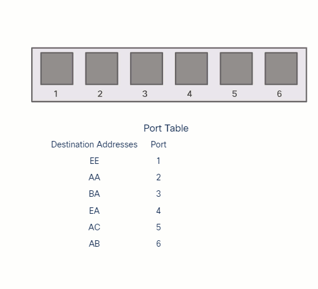
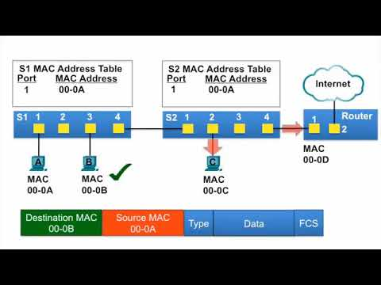
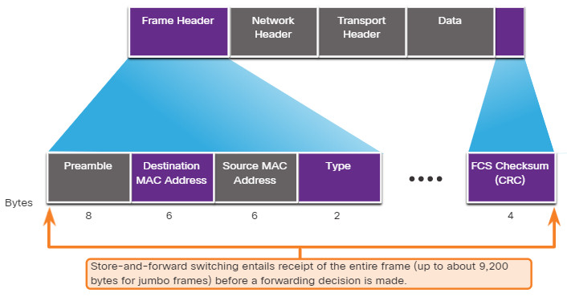
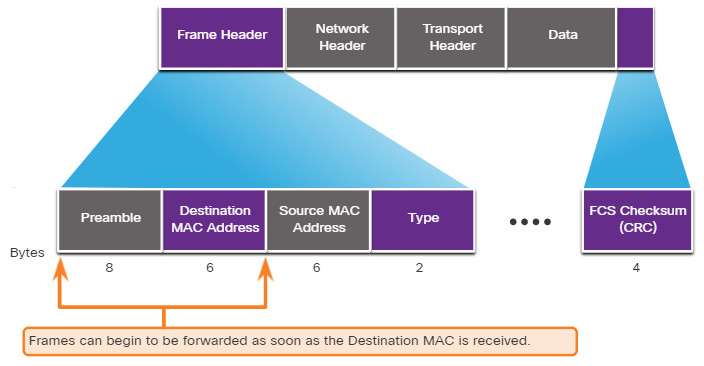

#book2
# 2.1 Frame Forwarding
## 2.1.1 Switching in Networking
Идея switching очень простая: `switch` получает Ethernet frame, смотрит на нужную информацию и решает, **куда его переслать**.
В `LAN switching` решение принимается на основе:
- `ingress port`;
- `destination MAC address`.
**MAC address** — физический адрес сетевого интерфейса на канальном уровне. #networkterm  
**destination MAC address** — MAC address устройства, которому предназначен frame. #networkterm
Очень важное правило:
- Ethernet frame **никогда не отправляется обратно в тот же port**, через который он пришёл.

> [!important] Как понять тему
> Switch не “думает как router”.  
> Он не анализирует IP-маршруты, а смотрит на `MAC address table`.
## 2.1.2 The Switch MAC Address Table
Чтобы switch знал, куда отправлять frame, он хранит специальную таблицу.
**MAC address table** — таблица соответствия `MAC address -> switch port`. #networkterm  
**CAM table** — другое название MAC address table. #networkterm  
**CAM (Content Addressable Memory)** — специальная память для очень быстрого поиска записей. #abbreviation
Что хранится в таблице:
- MAC address устройства;
- port, на котором устройство было замечено;
- таймер жизни записи.
Дополнительно полезная команда:
```bash
S1# show mac address-table
```
`show mac address-table` #ciscoIOScommand
Показывает, какие MAC addresses switch уже изучил и к каким портам они привязаны.
> [!tip] Что реально надо понять
> Switch не знает всё заранее.  
> Он **учит** MAC addresses по мере прохождения traffic.
## 2.1.3 The Switch Learn and Forward Method
Каждый Ethernet frame, который входит в switch, проходит две логические стадии:
1. `Learn`
2. `Forward`
### Step 1. Learn
Switch смотрит на:
- `source MAC address`;
- `incoming port`.
**source MAC address** — MAC address отправителя frame. #networkterm
Если source MAC ещё нет в таблице:
- switch добавляет новую запись.
Если source MAC уже есть:
- switch обновляет timer;
- при необходимости меняет port в записи.
### Step 2. Forward
Теперь switch смотрит на `destination MAC address`.
Варианты:
- если MAC найден в таблице -> frame идёт в конкретный egress port;
- если MAC не найден -> switch flood'ит frame на все порты, кроме ingress port;
- если frame broadcast или multicast -> тоже идёт flooding.
**unknown unicast** — unicast frame, у которого destination MAC ещё не найден в MAC table. #networkterm  
**flooding** — отправка frame на все порты, кроме входящего. #networkterm  
**broadcast** — передача всем устройствам сегмента. #networkterm  
**multicast** — передача группе устройств. #networkterm

> [!warning] Частый exam момент
> `Unknown unicast` не дропается сразу.  
> Switch обычно делает `flooding`.
## 2.1.4 MAC Address Tables on Connected Switches
Когда два switches соединены между собой, оба строят свои MAC tables постепенно.
Это важно понять:  
каждый switch учится **со своей стороны**, на основе source MAC addresses кадров, которые он видит.
Если network новая и таблицы ещё пустые, сначала может быть больше flooding, а потом forwarding становится точнее.
## 2.1.5 Switching Forwarding Methods
Switch может пересылать frames разными методами.
Два главных метода:
- `store-and-forward switching`
- `cut-through switching`
**ASIC (Application-Specific Integrated Circuit)** — специализированная микросхема, ускоряющая switching decisions. #abbreviation
ASIC нужен для того, чтобы switch мог очень быстро обрабатывать большой поток frames.

|Method|Главная идея|
|---|---|
|`Store-and-forward`|Сначала принять весь frame, потом проверить и переслать|
|`Cut-through`|Начать пересылку как можно раньше, не дожидаясь всего frame|
## 2.1.6 Store-and-Forward Switching
**store-and-forward switching** — метод, при котором switch сначала получает frame целиком, а потом решает, пересылать его или нет. #networkterm
Главные особенности:
- выполняется `FCS/CRC` check;
- есть buffering;
- ошибки можно отфильтровать до отправки дальше.
**FCS (Frame Check Sequence)** — поле Ethernet frame для проверки ошибок. #abbreviation  
**CRC (Cyclic Redundancy Check)** — математическая проверка целостности frame. #abbreviation  
**buffering** — временное хранение frame в памяти перед пересылкой. #networkterm
Почему это полезно:
- switch не пересылает повреждённые frames;
- удобнее работать, когда `ingress` и `egress` ports имеют разную speed.

> [!tip] Как запомнить
> `Store-and-forward = safer, checks errors`
## 2.1.7 Cut-Through Switching
**cut-through switching** — метод, при котором switch начинает forwarding очень рано, как только понял destination MAC и egress port. #networkterm
Плюсы:
- меньше latency;
- быстрее forwarding.
Минусы:
- switch может переслать frame с ошибкой;
- полноценной проверки `FCS` до forwarding нет.
**latency** — задержка передачи данных. #networkterm
Есть ещё вариант:
- `fragment-free switching`
**fragment-free switching** — модификация cut-through, где switch ждёт немного дольше, чтобы снизить риск пересылки повреждённых fragments. #networkterm


|Method|Плюс|Минус|
|---|---|---|
|`Store-and-forward`|Проверяет ошибки|Чуть выше latency|
|`Cut-through`|Очень быстро|Может переслать bad frame|
> [!success] Если понял тему
> Ты уже понимаешь:
> - как switch учит `MAC addresses`;
> - что такое `unknown unicast`;
> - почему бывает `flooding`;
> - чем `store-and-forward` отличается от `cut-through`.
