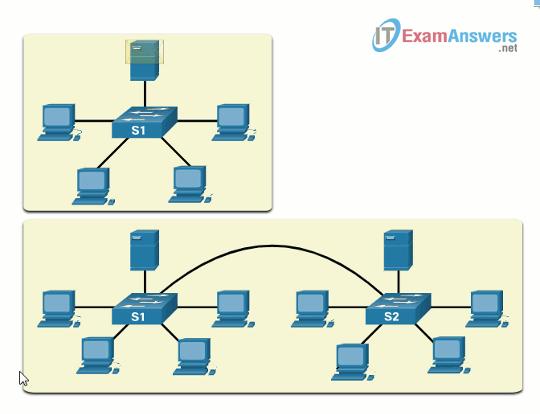

#book2
# 2.2 Collision and Broadcast Domains
## 2.2.1 Collision Domains
Чтобы понять switching domains, представь старую сеть с `hub`.  
Там все устройства делили одну общую среду передачи.
**collision domain** — область сети, где кадры могут столкнуться, если несколько устройств передают одновременно. #networkterm
Это было особенно характерно для старого Ethernet с `half-duplex`.
Если switch port работает в `half-duplex`, такой сегмент может быть collision domain.
Если switch port работает в `full-duplex`, нормальных collisions уже не ожидается.
**hub** — устройство физического уровня, которое просто повторяет сигнал на все порты. #networkterm
> [!note] Image note
> Оригинальная collision-domain схема на сайте отдаётся нестабильно, поэтому здесь оставил текстовое объяснение без внешней ссылки, чтобы в vault не было удалённых media links.
    
> [!tip] Самая важная мысль
> `Full-duplex` practically removes normal Ethernet collisions.  
> `Half-duplex` keeps collision-domain behavior.
## 2.2.2 Broadcast Domains
**broadcast domain** — группа устройств, которые получают один и тот же Layer 2 broadcast frame. #networkterm
Если несколько switches соединены друг с другом без router между ними, они обычно образуют **один broadcast domain**.
Очень важное правило:
- `router` разделяет broadcast domains;
- обычный Layer 2 switch сам по себе broadcast domain не делит.
Когда устройство отправляет Layer 2 broadcast:
- destination MAC = все единицы;
- switch отправляет frame на все порты, кроме ingress port.
**MAC broadcast domain** — Layer 2 broadcast domain на основе Ethernet/MAC forwarding. #networkterm

> [!warning] Частый exam trap
> Соединение двух switches обычно **расширяет** broadcast domain, а не делит его.
## 2.2.3 Alleviate Network Congestion
**congestion** — перегрузка сети, когда traffic становится слишком много и производительность падает. #networkterm
Switches помогают уменьшать congestion за счёт своих свойств.
Главные факторы:
- fast port speeds;
- fast internal switching;
- large frame buffers;
- high port density.
### 1. Fast port speeds
Чем выше speed ports, тем меньше chance, что traffic будет “упираться” в канал.
### 2. Fast internal switching
Switch должен быстро передавать frames внутри себя, а не только иметь быстрые внешние ports.
### 3. Large frame buffers
**frame buffer** — область памяти, где frames временно хранятся перед forwarding. #networkterm
Это особенно полезно, когда:
- ingress port faster than egress port;
- traffic приходит всплесками.
### 4. High port density
**port density** — количество ports на одном switch. #networkterm
Если ports много:
- можно уменьшить число switches;
- traffic чаще остаётся локальным;
- уменьшается лишняя передача между устройствами.

|Term|Что нужно помнить|
|---|---|
|`Collision domain`|Где возможны collisions|
|`Broadcast domain`|Кто получает Layer 2 broadcasts|
|`Router`|Делит broadcast domains|
|`Full-duplex`|Убирает collision behavior в нормальной switched link|
> [!success] Если понял тему
> Ты уже понимаешь:
> - разницу между `collision domain` и `broadcast domain`;
> - почему `router` делит broadcast domains;
> - как switches уменьшают congestion.
