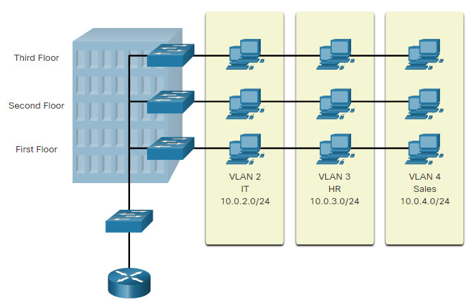
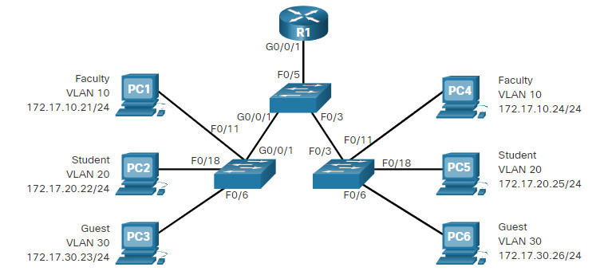
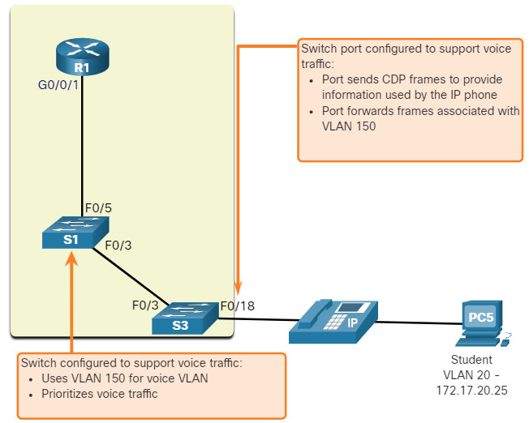

#book2

# 3.1 Overview of VLANs

## 3.1.1 VLAN Definitions

VLANs дают **segmentation** и **organizational flexibility** в switched network.

**segmentation** — разделение сети на отдельные логические части. #networkterm

Устройства внутри одной VLAN общаются так, как будто они подключены к одному и тому же кабелю, даже если физически находятся на разных switches.

Главное, что нужно понять:

- VLANs строятся на **logical connections**, а не на physical location;
- каждая VLAN считается отдельной **logical network**;
- broadcast внутри одной VLAN не должен уходить в другую VLAN.

**logical network** — сеть, определённая логикой конфигурации, а не физическим расположением устройств. #networkterm

Если device должен связаться с device из другой VLAN, нужен device с routing capability.

> [!important] Ключевая мысль
> `One VLAN = one logical broadcast domain`

## 3.1.2 Benefits of a VLAN Design

VLAN design даёт несколько очень практичных плюсов.

|Benefit|Что это значит|
|---|---|
|Smaller broadcast domains|Меньше лишнего broadcast traffic|
|Improved security|Пользователи из разных VLAN не смешиваются на Layer 2|
|Improved IT efficiency|Легче администрировать группы пользователей|
|Reduced cost|Меньше лишних апгрейдов и эффективнее используются uplinks|
|Better performance|Меньше unnecessary traffic|
|Simpler project/application management|Легче делить сеть по функциям или командам|

**broadcast domain** — группа устройств, которые получают один и тот же Layer 2 broadcast. #networkterm

> [!tip] Как запомнить
> VLANs делают сеть **меньше логически**, даже если физически она осталась большой.

## 3.1.3 Types of VLANs

Не все VLANs используются одинаково.

Основные types:

- `Default VLAN`
- `Data VLAN`
- `Native VLAN`
- `Management VLAN`
- `Voice VLAN`

### Default VLAN

На Cisco switch по умолчанию это `VLAN 1`.

Факты:

- все ports по умолчанию в `VLAN 1`;
- native VLAN по умолчанию тоже `VLAN 1`;
- management VLAN по умолчанию тоже `VLAN 1`;
- `VLAN 1` нельзя удалить или переименовать.

> [!warning] Важный exam момент
> Использовать `VLAN 1` как native и management VLAN одновременно считается плохой practice и security risk.

### Data VLAN

**Data VLAN** — VLAN для user-generated traffic. #networkterm

Это обычная пользовательская VLAN, в которой живут PCs, printers и другие end devices.

### Native VLAN

**Native VLAN** — VLAN, в которую trunk port относит untagged traffic. #networkterm

На Cisco по умолчанию это `VLAN 1`, но best practice — назначить отдельную unused VLAN.

### Management VLAN

**Management VLAN** — VLAN для management traffic, например `SSH`, `Telnet`, `HTTPS`, `HTTP`, `SNMP`. #networkterm

### Voice VLAN

**Voice VLAN** — отдельная VLAN для `VoIP` traffic. #networkterm

**VoIP (Voice over IP)** — передача голоса через IP-сеть. #abbreviation

Voice traffic требует:

- assured bandwidth;
- priority;
- low delay.

## 3.1.4 Packet Tracer – Who Hears the Broadcast?

Идея activity простая: посмотреть, кто реально получает broadcast, когда VLANs есть и когда их нет.

Если прочитал и понял тему, то ты уже должен понимать:

- зачем VLANs нужны;
- почему они уменьшают broadcast traffic;
- почему `VLAN 1` не стоит оставлять как универсальную VLAN для всего.

> [!success] Итог темы
> `VLANs = segmentation + security + better management`
