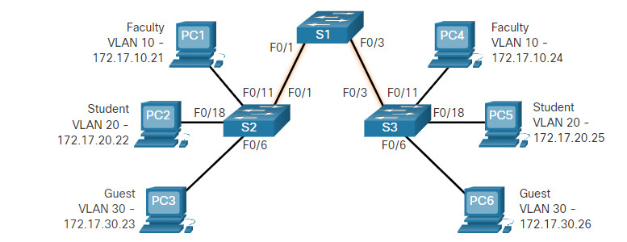
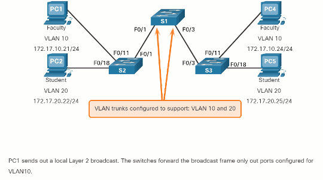
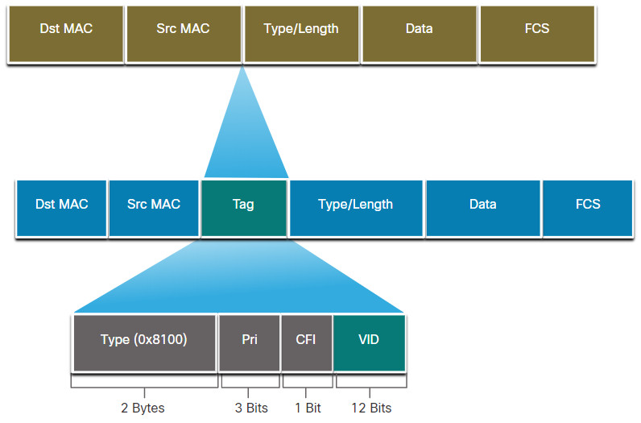

#book2

# 3.2 VLANs in a Multi-Switched Environment

## 3.2.1 Defining VLAN Trunks

Если VLAN есть только внутри одного switch, пользы мало.  
Чтобы одна и та же VLAN проходила через несколько switches, нужен **trunk**.

**trunk** — point-to-point link, который несёт traffic нескольких VLANs. #networkterm



**802.1Q** — стандарт tagging для Ethernet trunk links. #abbreviation

Главное:

- trunk не принадлежит одной конкретной VLAN;
- trunk переносит traffic нескольких VLANs;
- без trunk devices из одной VLAN, но на разных switches, не смогут нормально общаться.

## 3.2.2 Network without VLANs

Если VLANs не настроены, весь switched network может быть одним broadcast domain.

Тогда broadcast frame уходит практически ко всем devices внутри этой общей Layer 2 сети.

Это неудобно, потому что:

- растёт лишний traffic;
- растёт шум в сети;
- сложнее управлять пользователями по группам.

## 3.2.3 Network with VLANs

Когда VLANs включены, broadcast из одной VLAN остаётся внутри этой VLAN.



То есть:

- `Faculty VLAN` получает только свой traffic;
- `Student VLAN` получает только свой traffic;
- trunk links передают traffic нужных VLANs между switches.

> [!important] Что нужно понять
> VLAN ограничивает `unicast`, `multicast` и `broadcast` traffic рамками своей логической сети.

## 3.2.4 VLAN Identification with a Tag

Обычный Ethernet frame сам по себе не знает, к какой VLAN он относится.

Поэтому на trunk link switch добавляет **tag**.

**tagging** — добавление VLAN information в Ethernet frame. #networkterm



В 802.1Q tag есть основные поля:

- `TPID`
- `User Priority`
- `CFI`
- `VID`

**TPID (Tag Protocol Identifier)** — поле, показывающее, что frame tagged по 802.1Q. #abbreviation  
**VID (VLAN ID)** — идентификатор VLAN. #abbreviation  
**CFI (Canonical Format Identifier)** — служебный бит в tag field. #abbreviation

После добавления tag switch пересчитывает `FCS`.

**FCS (Frame Check Sequence)** — поле проверки целостности frame. #abbreviation

## 3.2.5 Native VLANs and 802.1Q Tagging

В 802.1Q есть понятие **native VLAN**.

Untagged frame, пришедший на trunk port, привязывается к native VLAN.

По умолчанию native VLAN — `VLAN 1`, но best practice:

- использовать отдельную unused VLAN;
- не смешивать её с data VLAN;
- не оставлять `VLAN 1` по умолчанию в продуманной сети.

Если trunk получает tagged frame с VLAN ID, совпадающим с native VLAN, Cisco switch может такой frame drop'нуть.

> [!warning] Exam trap
> На обоих концах trunk native VLAN должна совпадать.

## 3.2.6 Voice VLAN Tagging

Для `VoIP` обычно нужна отдельная **voice VLAN**.

Почему:

- голос чувствителен к delay;
- ему нужен priority;
- QoS policies проще применять отдельно.

Порт к Cisco IP Phone может нести:

- data VLAN для PC;
- voice VLAN для phone.

По сути это “маленький controlled trunk-like behavior” на access side.

## 3.2.7 Voice VLAN Verification Example

Полезная verification command:

```bash
S1# show interfaces fa0/18 switchport
```

`show interfaces fa0/18 switchport` #ciscoIOScommand
Показывает switchport settings интерфейса, включая:
- access VLAN;
- native VLAN;
- voice VLAN;
- trunking state.

В выводе важно уметь находить:

- `Access Mode VLAN: 20`
- `Voice VLAN: 150`

## 3.2.8 Packet Tracer – Investigate a VLAN Implementation

Эта activity закрепляет идею:

- без VLANs broadcast domain большой;
- с VLANs traffic ограничивается рамками нужной VLAN;
- trunk links нужны для связи одинаковых VLAN между switches.

> [!success] Итог темы
> `Access port = usually one VLAN`  
> `Trunk port = multiple VLANs`
