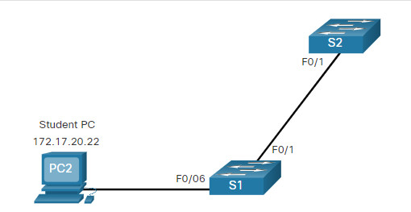

#book2

# 3.3 VLAN Configuration

## 3.3.1 VLAN Ranges on Catalyst Switches

Cisco switches поддерживают много VLAN IDs, но их делят на диапазоны.

|Range|Meaning|
|---|---|
|`1-1005`|Normal range VLANs|
|`1006-4094`|Extended range VLANs|

**normal range VLANs** — стандартный диапазон VLAN IDs для большинства сетей. #networkterm  
**extended range VLANs** — расширенный диапазон VLAN IDs, чаще для больших сетей и service providers. #networkterm

В normal range:

- `1` и `1002-1005` создаются автоматически;
- конфигурация хранится в `vlan.dat`.

**vlan.dat** — VLAN database file в flash memory switch. #networkterm

## 3.3.2 VLAN Creation Commands

Основные команды для создания VLAN:

```bash
Switch# configure terminal
Switch(config)# vlan 20
Switch(config-vlan)# name student
Switch(config-vlan)# end
```

`vlan 20` #ciscoIOScommand
Создаёт VLAN с ID 20.

`name student` #ciscoIOScommand
Назначает VLAN понятное имя. Это best practice, потому что так проще читать конфигурацию.

## 3.3.3 VLAN Creation Example



Пример:

```bash
S1# configure terminal
S1(config)# vlan 20
S1(config-vlan)# name student
S1(config-vlan)# end
```

Полезно помнить, что можно создавать:

- одну VLAN;
- список VLAN через запятую;
- диапазон через дефис.

## 3.3.4 VLAN Port Assignment Commands

После создания VLAN нужно назначить port в эту VLAN.

```bash
Switch# configure terminal
Switch(config)# interface fa0/6
Switch(config-if)# switchport mode access
Switch(config-if)# switchport access vlan 20
Switch(config-if)# end
```

`switchport mode access` #ciscoIOScommand
Переводит interface в permanent access mode.

`switchport access vlan 20` #ciscoIOScommand
Назначает interface в VLAN 20.

> [!tip] Главное понимание
> VLAN назначается на **switch port**, а не на end device.

## 3.3.5 VLAN Port Assignment Example

Если `Fa0/6` назначен в `VLAN 20`, то device на этом port считается частью `VLAN 20`.

Это значит, что PC должен иметь IP addressing, соответствующий subnet этой VLAN.

## 3.3.6 Data and Voice VLANs

Access port может иметь:

- одну data VLAN;
- и отдельно одну voice VLAN.

Это нужно, когда к switch подключён IP phone, а за ним ещё и PC.

## 3.3.7 Data and Voice VLAN Example

Пример:

```bash
S3(config)# vlan 20
S3(config-vlan)# name student
S3(config-vlan)# vlan 150
S3(config-vlan)# name VOICE
S3(config-vlan)# exit
S3(config)# interface fa0/18
S3(config-if)# switchport mode access
S3(config-if)# switchport access vlan 20
S3(config-if)# mls qos trust cos
S3(config-if)# switchport voice vlan 150
S3(config-if)# end
```

`mls qos trust cos` #ciscoIOScommand
Доверяет CoS marking для voice traffic от IP phone.

`switchport voice vlan 150` #ciscoIOScommand
Назначает voice VLAN на interface.

**QoS (Quality of Service)** — механизмы приоритизации и контроля трафика. #abbreviation  
**CoS (Class of Service)** — Layer 2 priority marking. #abbreviation

## 3.3.8 Verify VLAN Information

Главные show commands:

```bash
show vlan brief
show vlan summary
show interfaces fa0/18 switchport
show interfaces vlan 20
```

`show vlan brief` #ciscoIOScommand
Показывает VLAN names, status и ports.

`show vlan summary` #ciscoIOScommand
Показывает общее количество VLANs.

`show interfaces vlan 20` #ciscoIOScommand
Показывает состояние SVI VLAN 20.

## 3.3.9 Change VLAN Port Membership

Если port назначен не в ту VLAN, просто переназначь его:

```bash
switchport access vlan 20
```

Если нужно вернуть port в default VLAN:

```bash
no switchport access vlan
```

`no switchport access vlan` #ciscoIOScommand
Убирает явное назначение access VLAN и возвращает port к default behavior.

## 3.3.10 Delete VLANs

Чтобы удалить одну VLAN:

```bash
no vlan 20
```

`no vlan 20` #ciscoIOScommand
Удаляет VLAN из VLAN database.

Чтобы полностью удалить VLAN database:

```bash
delete flash:vlan.dat
```

`delete flash:vlan.dat` #ciscoIOScommand
Удаляет файл VLAN database из flash.

> [!warning] Очень важно
> Перед удалением VLAN сначала переназначь member ports в другую active VLAN.

## 3.3.11 Syntax Checker – VLAN Configuration

Здесь от тебя ожидается, что ты умеешь:

- создать data VLAN;
- создать voice VLAN;
- назначить их на port;
- проверить результат.

## 3.3.12 Packet Tracer – VLAN Configuration

Эта activity закрепляет весь цикл:

- verify default VLAN config;
- create VLANs;
- assign ports;
- verify output.

> [!success] Итог темы
> `Create VLAN -> assign port -> verify with show commands`
