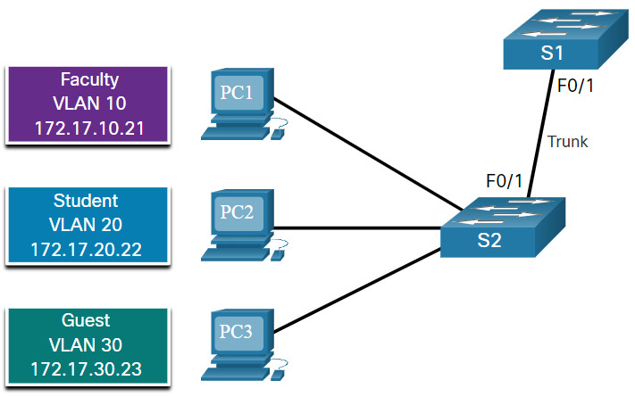

#book2

# 3.4 VLAN Trunks

## 3.4.1 Trunk Configuration Commands

Trunk нужен, чтобы между switches проходили multiple VLANs.

Команды:

```bash
Switch# configure terminal
Switch(config)# interface fa0/1
Switch(config-if)# switchport mode trunk
Switch(config-if)# switchport trunk native vlan 99
Switch(config-if)# switchport trunk allowed vlan 10,20,30,99
Switch(config-if)# end
```

`switchport mode trunk` #ciscoIOScommand
Переводит interface в permanent trunk mode.

`switchport trunk native vlan 99` #ciscoIOScommand
Меняет native VLAN trunk port на VLAN 99.

`switchport trunk allowed vlan 10,20,30,99` #ciscoIOScommand
Ограничивает список VLANs, разрешённых на trunk.

## 3.4.2 Trunk Configuration Example



В примере:

- VLANs `10`, `20`, `30` несут user traffic;
- VLAN `99` используется как native VLAN;
- trunk port между switches переносит traffic этих VLANs.

> [!important] Правило
> На обоих концах trunk native VLAN должна совпадать.

## 3.4.3 Verify Trunk Configuration

Проверка:

```bash
S1# show interfaces fa0/1 switchport
```

`show interfaces fa0/1 switchport` #ciscoIOScommand
Показывает trunk/access mode, native VLAN, encapsulation и allowed VLANs.

На что смотреть:

- `Administrative Mode: trunk`
- `Operational Mode: trunk`
- `Trunking Native Mode VLAN: 99`
- `Trunking VLANs Enabled`

## 3.4.4 Reset the Trunk to the Default State

Чтобы сбросить trunk restrictions:

```bash
S1(config)# interface fa0/1
S1(config-if)# no switchport trunk allowed vlan
S1(config-if)# no switchport trunk native vlan
S1(config-if)# end
```

`no switchport trunk allowed vlan` #ciscoIOScommand
Убирает вручную заданный allowed VLAN list.

`no switchport trunk native vlan` #ciscoIOScommand
Возвращает native VLAN к default.

Если нужно вообще убрать trunk mode:

```bash
S1(config-if)# switchport mode access
```

`switchport mode access` #ciscoIOScommand
Возвращает interface в static access mode.

## 3.4.5 Packet Tracer – Configure Trunks

Ожидаемые навыки:

- проверить существующие VLANs;
- настроить trunk;
- проверить trunk state.

## 3.4.6 Lab – Configure VLANs and Trunking

В lab ты проходишь полный путь:

- build the network;
- create VLANs;
- assign switch ports;
- maintain VLAN database;
- configure 802.1Q trunk.

> [!success] Итог темы
> `Trunk = multi-VLAN link using 802.1Q`
